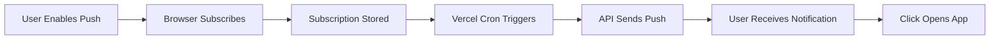

<div align="center">

# 🚀 Daily Work DashBoard

### *Your 60-Day Success Blueprint, Automated* ⚡

**Transform chaos into clarity. Track tasks, capture leads, and never miss a deadline—all in one beautiful dashboard.**

[](https://nextjs.org/)
[](https://react.dev/)
[](https://www.typescriptlang.org/)
[](https://tailwindcss.com/)
[](LICENSE)
[](https://vercel.com)

[🎯 Live Demo](#) • [📖 Documentation](./PUSH_NOTIFICATIONS_SETUP.md) • [🚀 Quick Start](./QUICK_START.md) • [💬 Support](#contact)

</div>

---

## 📑 Table of Contents

- [✨ What is Daily Work DashBoard?](#-what-is-daily-work-dashboard)
- [🎬 Screenshots & Demo](#-screenshots--demo)
- [🔥 Features](#-features)
- [🛠️ Tech Stack](#️-tech-stack)
- [⚡ Quick Start](#-quick-start)
- [📦 Installation](#-installation)
- [⚙️ Configuration](#️-configuration)
- [💡 Usage Examples](#-usage-examples)
- [📂 Project Structure](#-project-structure)
- [🔔 Push Notifications](#-push-notifications)
- [🚀 Deployment](#-deployment)
- [🤝 Contributing](#-contributing)
- [📄 License](#-license)
- [👨‍💻 Author](#-author)

---

## ✨ What is Daily Work DashBoard?

**Daily Work DashBoard** is not just another task manager—it's your *intelligent work companion* designed specifically for agencies and consultants running 60-day client acquisition plans.

### 🎯 The Problem We Solve

Running a client acquisition campaign means juggling:
- 📋 Daily tasks that can't be missed
- 🎯 Leads that need constant follow-up
- 💰 Revenue tracking to stay profitable
- ⏰ Reminders that actually work (even when you're offline!)

### 💡 Our Solution

A **single, beautiful dashboard** that:
- ✅ Tracks everything in real-time
- 🔔 Sends push notifications even when the app is closed
- 📊 Visualizes your progress with stunning charts
- 📱 Works offline as a Progressive Web App
- 🤖 Automates daily reminders via Vercel Cron

**Built for speed. Designed for results. Powered by modern web tech.**

---

## 🎬 Screenshots & Demo

<div align="center">

### 🖥️ Dashboard Overview
*Coming Soon: Add your screenshot here*

### 📱 Mobile Experience
*Coming Soon: Add your mobile screenshot here*

### 🔔 Push Notifications in Action
*Coming Soon: Add notification screenshot here*

</div>

> 🎥 **Live Demo:** [View Demo](#) *(Deploy and add your link here)*

---

## 🔥 Features

<table>
<tr>
<td width="50%">

### 📊 Core Features
- ✔️ **Task Tracker** - Organize daily tasks with status tracking
- ✔️ **Lead Management** - Track prospects from cold to closed
- ✔️ **Revenue Dashboard** - Visualize income vs expenses
- ✔️ **Summary Cards** - Real-time metrics at a glance
- ✔️ **Data Export** - Download reports as CSV/PDF

</td>
<td width="50%">

### 🚀 Advanced Features
- ✔️ **Push Notifications** - Works even when app is closed
- ✔️ **PWA Support** - Install on any device
- ✔️ **Offline Mode** - Service Worker caching
- ✔️ **Automated Reminders** - Vercel Cron integration
- ✔️ **Secure Auth** - Password-protected access

</td>
</tr>
</table>

### 🎨 User Experience
- 🌙 **Dark Mode** - Easy on the eyes
- ⚡ **Lightning Fast** - Optimized with Next.js 15
- 📱 **Responsive Design** - Perfect on any screen size
- ♿ **Accessible** - ARIA-compliant components
- 🎯 **Intuitive UI** - Built with Radix UI primitives

---

## 🛠️ Tech Stack

<div align="center">

| Category | Technologies |
|----------|-------------|
| **Frontend** |    |
| **Styling** |   |
| **State & Forms** |   |
| **Charts** |  |
| **Notifications** |   |
| **Deployment** |   |
| **Data Export** |   |

</div>

### 🎯 Why This Stack?

- ⚡ **Next.js 15** - Server components, streaming, and edge runtime
- 🎨 **Tailwind CSS 4** - Utility-first styling with zero runtime
- 🔔 **Web Push API** - Native browser notifications (no Firebase needed!)
- 📊 **Recharts** - Beautiful, responsive charts out of the box
- 🚀 **Vercel** - Zero-config deployment with automatic HTTPS

---

## ⚡ Quick Start

Get up and running in 60 seconds:

```bash
# Clone the repository
git clone https://github.com/virajverse/Daily-Work-DashBoard.git

# Navigate to project
cd Daily-Work-DashBoard

# Install dependencies
npm install

# Generate VAPID keys for push notifications
node scripts/generate-vapid-keys-proper.js

# Copy the keys to .env.local (see Configuration section)

# Start development server
npm run dev
```

🎉 **That's it!** Open [http://localhost:3000](http://localhost:3000) and start tracking!

---

## 📦 Installation

### Prerequisites

- **Node.js** 18.17+ or 20.3+ or 21+
- **npm** or **pnpm** or **yarn**
- A modern browser (Chrome, Firefox, Edge, Safari 16.4+)

### Step-by-Step Installation

```bash
# 1. Clone the repository
git clone https://github.com/virajverse/Daily-Work-DashBoard.git
cd Daily-Work-DashBoard

# 2. Install dependencies
npm install
# or
pnpm install
# or
yarn install

# 3. Generate VAPID keys for push notifications
node scripts/generate-vapid-keys-proper.js

# 4. Create environment file
cp .env.example .env.local
# Then edit .env.local with your keys

# 5. Run development server
npm run dev

# 6. Build for production
npm run build

# 7. Start production server
npm start
```

---

## ⚙️ Configuration

### Environment Variables

Create a `.env.local` file in the root directory:

```env
# Authentication
DASHBOARD_PASSWORD=your-secure-password

# VAPID Keys for Push Notifications (generate with script)
NEXT_PUBLIC_VAPID_PUBLIC_KEY=your-public-key-here
VAPID_PRIVATE_KEY=your-private-key-here
VAPID_EMAIL=mailto:your-email@taliyotech.com

# App Configuration
NEXT_PUBLIC_APP_URL=http://localhost:3000

# Cron Job Security (for automated reminders)
CRON_SECRET=your-random-secret-key-here
```

### 🔑 Generate VAPID Keys

VAPID keys are required for push notifications:

```bash
node scripts/generate-vapid-keys-proper.js
```

Copy the output directly into your `.env.local` file.

### ⏰ Configure Reminder Time

Edit `vercel.json` to change when daily reminders are sent:

```json
{
  "crons": [
    {
      "path": "/api/cron/daily-reminder",
      "schedule": "30 3 * * *"  // 9:00 AM IST (3:30 AM UTC)
    }
  ]
}
```

**Cron Schedule Examples:**
- `0 9 * * *` - 9:00 AM UTC daily
- `30 3 * * *` - 9:00 AM IST daily
- `0 9 * * 1-5` - 9:00 AM UTC weekdays only
- `0 */6 * * *` - Every 6 hours

---

## 💡 Usage Examples

### 1️⃣ Adding a Task

```typescript
// Tasks are managed through the UI
// Click "Add Task" → Fill details → Save
// Tasks automatically sync to localStorage
```

### 2️⃣ Enabling Push Notifications

```typescript
// In the Dashboard:
// 1. Click "Enable Push Notifications"
// 2. Allow browser permission
// 3. Test with "Test Notification" button
// 4. Set your preferred reminder time
```

### 3️⃣ Exporting Data

```typescript
// Export tasks to CSV
const exportTasks = () => {
  // Click "Export" button in Task Tracker
  // Downloads tasks.csv automatically
}

// Export to PDF
const exportPDF = () => {
  // Click "Export PDF" in any section
  // Generates formatted PDF report
}
```

### 4️⃣ API Usage (Cron Job)

```bash
# Manually trigger daily reminder (for testing)
curl -X GET https://your-app.vercel.app/api/cron/daily-reminder \
  -H "Authorization: Bearer your-cron-secret"
```

---

## 📂 Project Structure

```
Daily-Work-DashBoard/
├── 📁 app/
│   ├── 📁 api/
│   │   ├── 📁 cron/
│   │   │   └── 📁 daily-reminder/
│   │   │       └── route.ts          # Automated reminder endpoint
│   │   ├── 📁 push/
│   │   │   ├── 📁 send/
│   │   │   │   └── route.ts          # Send push notifications
│   │   │   └── 📁 subscribe/
│   │   │       └── route.ts          # Subscribe to push
│   │   └── 📁 vapid-key/
│   │       └── route.ts              # Get public VAPID key
│   ├── 📁 server-actions/
│   │   └── auth.ts                   # Authentication logic
│   ├── globals.css                   # Global styles
│   ├── layout.tsx                    # Root layout
│   ├── page.tsx                      # Dashboard page
│   └── login/
│       └── page.tsx                  # Login page
├── 📁 components/
│   ├── 📁 dashboard/
│   │   ├── lead-table.tsx            # Lead tracker component
│   │   ├── notifications-panel.tsx   # Push notification UI
│   │   ├── revenue-expense-chart.tsx # Financial charts
│   │   ├── summary-cards.tsx         # Metrics overview
│   │   └── task-table.tsx            # Task management
│   ├── 📁 pwa/
│   │   └── pwa-init.tsx              # PWA initialization
│   └── 📁 ui/
│       └── ...                       # Reusable UI components
├── 📁 hooks/
│   └── use-toast.ts                  # Toast notifications hook
├── 📁 lib/
│   ├── utils.ts                      # Utility functions
│   └── web-push.ts                   # Web Push helpers
├── 📁 public/
│   ├── 📁 icons/
│   │   ├── icon-192.jpg              # PWA icon
│   │   └── icon-512.jpg              # PWA icon
│   ├── manifest.webmanifest          # PWA manifest
│   └── sw.js                         # Service Worker
├── 📁 scripts/
│   └── generate-vapid-keys-proper.js # VAPID key generator
├── .env.local                        # Environment variables (create this)
├── vercel.json                       # Vercel config + Cron
├── package.json                      # Dependencies
├── tailwind.config.ts                # Tailwind configuration
├── tsconfig.json                     # TypeScript config
├── QUICK_START.md                    # Quick setup guide
├── PUSH_NOTIFICATIONS_SETUP.md       # Detailed push setup
└── README.md                         # You are here! 👋
```

---

## 🔔 Push Notifications

### How It Works



### Features

- ✅ **Works Offline** - Notifications delivered even when app is closed
- ✅ **Cross-Platform** - Chrome, Firefox, Edge, Safari 16.4+
- ✅ **Secure** - VAPID authentication
- ✅ **Automated** - Vercel Cron schedules daily reminders
- ✅ **Customizable** - Set your own reminder time

### Setup Guide

📖 **Detailed Guide:** [PUSH_NOTIFICATIONS_SETUP.md](./PUSH_NOTIFICATIONS_SETUP.md)

🚀 **Quick Start:** [QUICK_START.md](./QUICK_START.md)

---

## 🚀 Deployment

### Deploy to Vercel (Recommended)

[](https://vercel.com/new/clone?repository-url=https://github.com/virajverse/Daily-Work-DashBoard)

**Manual Deployment:**

```bash
# 1. Install Vercel CLI
npm i -g vercel

# 2. Login to Vercel
vercel login

# 3. Deploy
vercel

# 4. Add environment variables in Vercel Dashboard
# Settings > Environment Variables > Add all from .env.local

# 5. Deploy to production
vercel --prod
```

### Environment Variables on Vercel

Add these in **Vercel Dashboard → Settings → Environment Variables:**

- `DASHBOARD_PASSWORD`
- `NEXT_PUBLIC_VAPID_PUBLIC_KEY`
- `VAPID_PRIVATE_KEY`
- `VAPID_EMAIL`
- `NEXT_PUBLIC_APP_URL` (your production URL)
- `CRON_SECRET`

### Vercel Cron Setup

✅ **Automatic!** Vercel reads `vercel.json` and sets up cron jobs automatically.

Check logs: **Vercel Dashboard → Deployments → Functions → Logs**

---

## 🤝 Contributing

We love contributions! Here's how you can help:

### 🐛 Found a Bug?

1. Check [existing issues](https://github.com/virajverse/Daily-Work-DashBoard/issues)
2. Create a new issue with:
   - Clear title
   - Steps to reproduce
   - Expected vs actual behavior
   - Screenshots if applicable

### 💡 Have a Feature Idea?

1. Open a [feature request](https://github.com/virajverse/Daily-Work-DashBoard/issues/new)
2. Describe the feature and use case
3. We'll discuss and prioritize!

### 🔧 Want to Contribute Code?

```bash
# 1. Fork the repository
# 2. Create a feature branch
git checkout -b feature/amazing-feature

# 3. Make your changes
# 4. Commit with clear messages
git commit -m "Add amazing feature"

# 5. Push to your fork
git push origin feature/amazing-feature

# 6. Open a Pull Request
```

### 📋 Contribution Guidelines

- ✅ Follow existing code style
- ✅ Write clear commit messages
- ✅ Test your changes thoroughly
- ✅ Update documentation if needed
- ✅ Keep PRs focused and small

---

## 📄 License

```
Copyright © 2025 Taliyo Technologies. All rights reserved.

This software is proprietary and confidential. Unauthorized copying,
distribution, or use of this software is strictly prohibited.
```

[](LICENSE)

---

## 👨‍💻 Author

<div align="center">

### Built with ❤️ by **Taliyo Technologies**

**Empowering businesses with intelligent automation**

[](https://taliyotech.com)
[](https://github.com/taliyotech)
[](https://linkedin.com/company/taliyotech)
[](mailto:cofounder@taliyotechnologies.com)

</div>

---

## 🙏 Acknowledgments

- **Next.js Team** - For the amazing framework
- **Vercel** - For seamless deployment and cron jobs
- **Radix UI** - For accessible component primitives
- **Tailwind Labs** - For the best CSS framework
- **Open Source Community** - For inspiration and tools

---

<div align="center">

### ⭐ Star this repo if you find it useful!

**Made with 💻 and ☕ by Taliyo Technologies**

[⬆ Back to Top](#-daily-work-dashboard)

</div>
